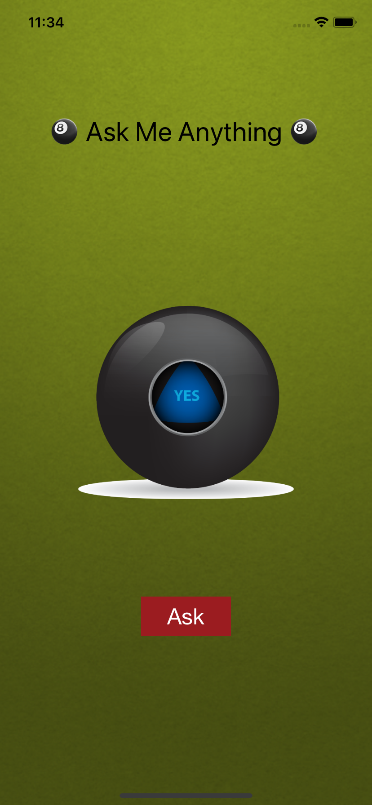

Eight Ball, Developed by Sebastian Güiza, using Xcode and App Brewery

# *** Eight Ball ***

Eight Ball was made to solve yes / no questions if you don't know what to decided

What I learned in this module was:

* How to clone an existing Xcode project from GitHub.
* Create an app with behaviour and functionality.
* Create links between the Interface Builder files and code using IBActions and IBOutlets.
* Get familiar with the Xcode code editor.
* Learn to use comments to annotate code.
* Understand and use Swift constants and variables.
* Understand and use collection types such as Swift arrays.
* Test and debug your app with the Xcode console.
* Learn about randomisation and how to generate random numbers in Swift.

Everybody who wants to use this application, ¡¡¡ 

# Enjoy it !!!

